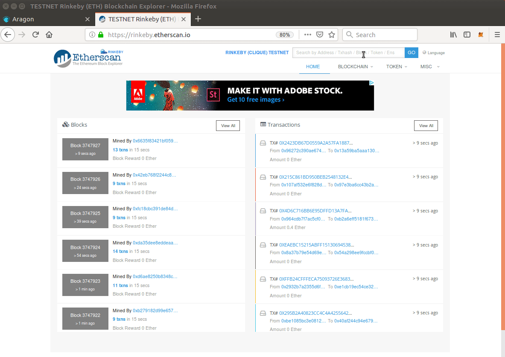

# Importing WIBB Tokens to your Metamask
1. First of all, you need to copy the contract address of the WIBB Token, which is: 0x7d4ccf6af2f0fdad48ee7958bcc28bdef7b732c7 

Alternatively, you can also find it on [Rinkeby Etherscan](https://rinkeby.etherscan.io/), tipping WIBB on the explorer and copying the contract address on the top right.

2. Open Metamask and click on the left menu. Go to "Add Token".

3. Paste WIBB token contract address and the rest of the fields will be automatically filled.

4. And ¡Voilà! You have your WIBB tokens imported on Metamask :)

