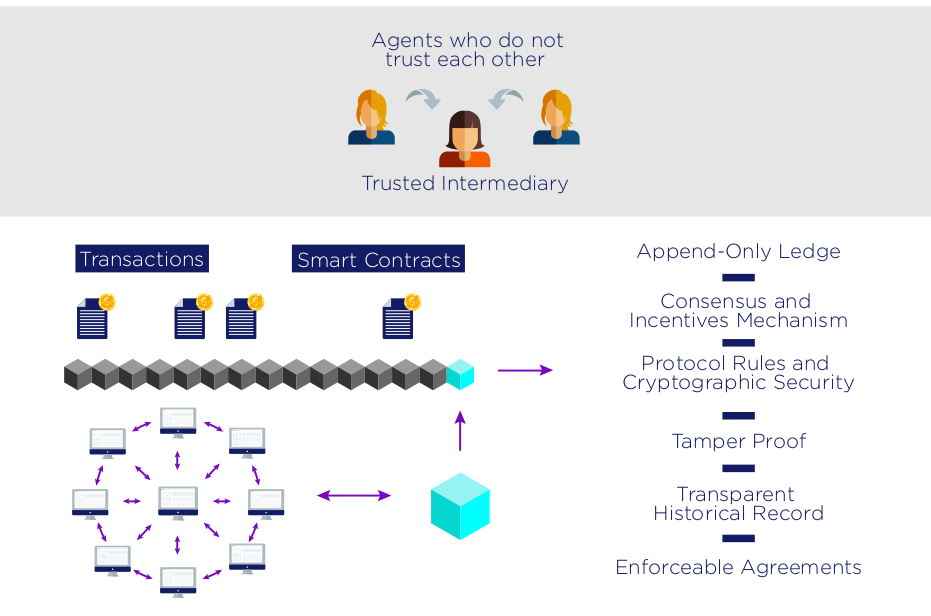
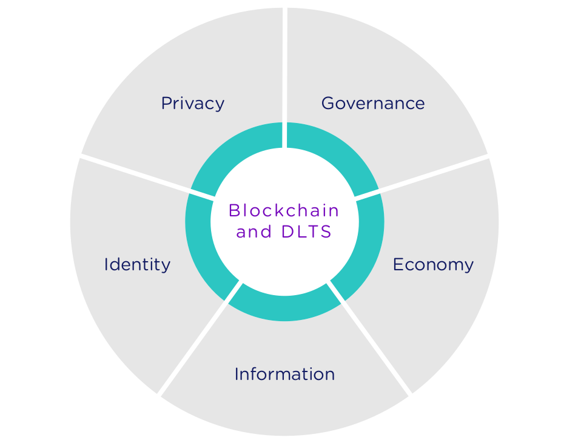
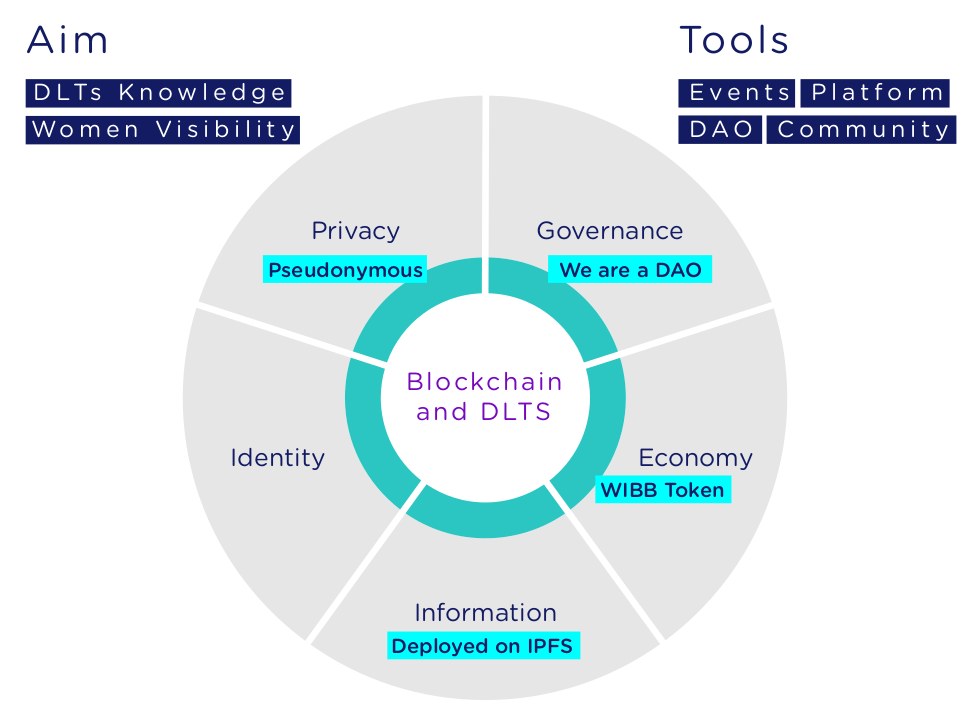
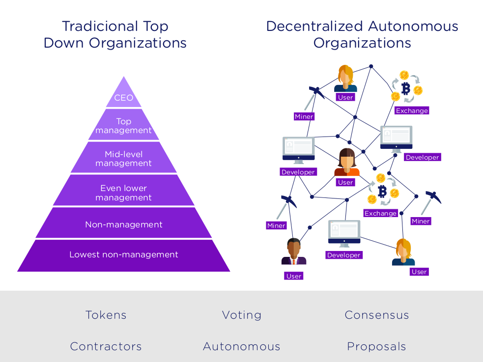

# 1. WIBB Context: Blockchain and DLTs
## 1.1. Where Do We Come From?
Intermediaries have been in the scene for a long time. They act as the nexus for facilitating transactions among individuals who don’t know each other. The scenario can be summed up pretty shortly: I don’t know you and you don’t know me but we want to interact with each other. How do we do that? We both trust a 3rd party (either a bank, business-service or whichever is the case) so we can operate through it. The intermediary charges a fee for this service and everybody is happy. 

This classical model has been very convenient but it presents some flaws. We have to deposit our trust on the intermediary, so what happens if it is not as trustful as we thought it was? What happens if it takes advantage of its power position? 
The problem doesn’t end here. An intermediary as a center of a system becomes also a single point of failure (SPoF) of that system. This means that if it is attacked/hacked or some sort of accident happens, the information/value that hold from their customers can be lost. 

## 1.2. Moving from Centralization to Decentralization
If we take off the game intermediaries we have a purely peer-to-peer-system, where users transact directly within each other. Why there wasn’t a solution until now? Coordination among individuals who don’t trust each other is not easy. The well-known Byzantine Generals Problem reflects this situation: imagine a group of generals who want to take over a city. They have to act in coordination and decide at every moment whether to attack or retrieve. It is very easy when we have a leader which takes decisions and tells everyone what to do. It's not that easy when we have an horizontal system. 

What blockchain has to offer is a general approach for reaching consensus on a reality (world-state) among a group of individuals (nodes) who don't know each other. Through a very shortly defined protocol, Bitcoin was the 1st successful blockchain use-case

## 1.3. Biggest Picture Overview
The technological progress that brings blockchain implies a convergence of all disciplines of knowledge in a way never seen before.
Thinking about how our society organizes, we can identify different layers.
On the bottom layer we have the basic understanding of the primary pillars that sustain everything else. This means, redefining the bottom layer is changing the way we organize and think of a society today.

Algoritmic Bias.

### a) Governance
Throughout history, centralized political organizations, bureaucracy and representative democracy have been a solution to a scaling problem: coordination and decision-making processes among an heterogeneous group of people.  They have been mostly developed for the purpose of reaching consensus and coordination between heterogeneous or distant groups of people, facilitating their mutual interactions.

Despite this, centralized organizations with top-down structures tend to be are systematically exposed to significant risks, such as lack of transparency, corruption, and a big target of all kind of coercions (Single Point of Failure). Which brings the classic question: "who will watch the watchmen?"

Decentralization aims to reduce or prevent such concentration of power and it is a fundamental condition for citizens to achieve political efficacy, equality, transparency, and freedom.

Digital jurisdiction for solving disputes. An example is the Futarchy model.

### b) Economy
Property

Flow of income

Micropayments

Incentives

### c) Information 
Blackbox society Decentralized storage Decentralized Intern
Companies follow the secrecy premise. Keeping information in the shade gives hyou  a competitive advantage.
But in a so globally world that we are leaving, what would happen if everything went public? Everything was auditable?
Storing information and decentralized stores
communication

### d) Identity
The process of atomization of identity towards local information comprises regaining possession, in deliberate graduated steps, of one’s identity, across a variety of spheres of life.
A mechanism that tractably maps information generated by an individual back to the individual immutably through time, without reference to a third party, provides that individual with a verifiable right to exclude; a mechanism that enables an individual to provide access to her identity to others in the mutable creation of collaborative value, yet tractably retain her attributable product from the association, provides her the right to use.

The right to exclude is a key strength of the blockchain; the right to use, however, requires using the blockchain as an infrastructure to access a range of value-creating activities across the cryptoeconomy.
Self-identity can lose almost all meaning in such ventures; it evolves within it so fundamentally, that it becomes harder to extricate a definable identity from it that coheres exactly with what went into it at the outset.

What is needed for self-identity to have a more meaningful connotation for the cryptoeconomy is a range for its elements – crisp elements at one extreme, such as a person’s name, passport number, contact details, and so forth, and fuzzy elements at the other, such as her interests, ambitions, hobbies or ideals. The ability to immutably instantiate crisp identities within any blockchain is straightforward; however, an individual would also have the ability to redefine her identity based on the information that she accumulates through participation in other applications of the technology, such as within commercial enterprises that employ the Lightning Network or a public ledger on patents, academic credentials or real estate. These enhancements to identity would occur so that, when information is shared through participation, identities would grow in an elastic manner to account for the contributions it makes to the self-identities of others in a society. This makes identity an elastic asset, rather than a static one.

Seeing self-identity as an elastic asset is best done when we imagine it as a particular package of contractual rights a person possesses over her productive ideas. Such rights can be specific to the individual as well as residual over the set of all specifiable and unspecifiable ideas that individuals collaborate with in an enterprise. Where the residual rights over any given expansion of the set of ideas permits more productive use than when farmed out to other individuals, the self-identity of an individual grows. This is a fundamental insight of the incomplete contract literature. Fundamentally, what this suggests for blockchains is that until they are not interoperable across a wide set of applications, the benefit of self-identity on the blockchain is limited to not much more than digital safekeeping of its crispest elements

### e) Privacy
Centralized platforms are very useful for coordinating activities yet, they often come at the expense of privacy. Users of these platforms need to share their personal data in order to use their services, without even knowing what these operators will do with their data.

Decentralized platforms given that there is no central authority in charge of managing the network, coordination can only be achieved by disclosing information to all nodes, which means that decentralized systems requiere a higher degree of transparency in order to operate. For that reason the impact of decentralization on the privacy and confidentiality of information comes at 2 levels:
* on a content level: decentralization reduces the chances of monitoring by a centralized authority
* on a protocol level (metadata): the openness and transparency of a decentralized network also make information more vulnerable to third parties’ grab.

# 2. About the WIBB Project
## 2.1. Aim
The first aim of this project is to share and expand a deep understanding on what blockchain is and why it is important for our society, through a women voice. The end goal is to culminate this knowledge in a tool that people can use to contribute on redefining the layers above expose. By this we can transform the structures that hold the system of our societies we know today, in a non-precedent way.

We cannot be neutral since society is not. We believe that giving the voice to women will help to invert the trend of .

Cohesion, vertex

## 2.2. Target
Our target audience are people motivated with this technological, social and economic change we are going through. People who want to know more and xx Everyone can attend to the events we organize. We specially encourage people from different backgrounds, since this will enrich our community and give us other insights and perspectives.

It is an inclusive community.

## 2.3. Strategy
WIBB Project is build upon 2 vertex: the events and the platform. These 2 vertex nourish each other and reinforce the global aim of the project.
### a) Events
The WIBB events are classified on:
* talks
* technical workshops
* networking events
* panel discussion

The common denominator of these events is that the speakers/leads are always women.
Each event will be focused to address a specific topic. This topic will be classified in one of the 6 topics we have defined (can be redefined in the course of our experience).
The idea is to fulfill each of these categories with knowledge, insights and ideas coming from the events. These categories, will interconnect with each other (still tbd). 
How will we achieve this? With the help of the WIBB Platform. 

Distributing knowledge
### b) Knowledge Digestion
WIBB Platform gathers all the know-how derived from the events. This is extremely necessary in order to build a structure around them. The idea is to provide a shared repository where participants can add and connect knowledge. The interesting thing here is connecting knowledge from different disciplines (with the common nexus of blockchain). WIBB Platform will also act as the event “connecting-thread”. First approach would be a decentralized platform on top of Ethereum deployed on IPFS. The basis of the needed features is currently under definition, hoping receiving more inputs derived from the future event themselves.

## 2.4. Location
We are based in Barcelona and the events take place in the city.
Depotlab is hosting our events right now. We are very thankful to them and kindly transfer our gratitude to them for betting on us from the very beginning. 
We are also connected globally around the world. We use international blockchain conferences to promote our project and to work on synergies with other aligned projects. 
## 2.5. Social Media
* [Twitter Account](https://twitter.com/wiblockchainbcn)
* [Meetup Group](https://www.meetup.com/es-ES/Women-in-Blockchain-Barcelona-Local-Group/)
# 3. About WIBB Governance
## 3.1. WIBB DAO - Decentralized Autonomous Organization
WIBB community operates as a Decentralized Autonomous Organization (DAO). The basic idea of a DAO is to move from an old-fashion hierarchic system to an horizontal peer-to-peer coordination.

Horizontal organizations are not new. We can find some examples of communities which have this assambleary model of taking decisions,. So what advantages offers DAOs?

DAOs have a token built intrinsically and are deployed on a blockchain – meaning they are transparent and its data is accessible to everyone.

Furthermore, they have built-in enforceable agreements through smart-contracts. Smart contracts are short powerful programs/scrips deployed also on the blockchain.  This means that agreements have guarantee of execution, this concept is also known as “the rule of code”.

Governances is much more than aggregating votes, that’s why we are experimenting. Distance participation, vote delegation

WIBB DAO Address is 0xc0B4682Cf65518fbC0602aF6D735B4fcaBd8B080

## 3.2. WIBB Token
We have a token, called “WIBB” build on top of Aragon.
Since it is an ERC20 compatible, you can easily import the token to your wallet. Its smart contract address is: 0x7d4ccf6af2f0fdad48ee7958bcc28bdef7b732c7

We operate on Rinkeby (the Ethereum testnet). For every transaction you want to make, you would also need Ethers from Rinkeby (you can ask them to Rinkeby faucet, or contact WIBB directly and we will provide some to you).
Bear in mind that WIBB and Ethers from Rinkeyby don’t hold any real value on fiat (€/$..). the intention is exploring governance without any cost. 

## 3.3. WIBB DAPPs
Inside the WIBB DAO there are some DAPPs that we inherit directly from Aragon.

- Token Manager: app for minting tokens, distribute them and deleting if necessary.

- Voting: app for making proposals and voting transactions

- Finance: app or managing our funds. Right now we don’t have real funds, just some experimental tokens. We can explore the app as if we had real funds, so it can be a simulation on how would we manage our organization funds if we had them

- Permissions: app for managing permissions. Which app can do what? For now we leave this aside (only used for developing purposes right now)

Besides that, we are currently building another DAPP on top of Aragon, that specifically suits our needs.

- Event Manager: an app for creating and managing events. 

# 4. WIBB Roadmap

Link to open tasks

Implementing ENS,

Developing Event Manager

Considering developing a platform? IPFS

# 5. Contribute
Here are some ways for contributing to this project:

- Share [our events](https://www.meetup.com/es-ES/Women-in-Blockchain-Barcelona/) on social media and helps us reaching as much people as possible

- Connect us to women experts speakers from all the backgrounds

- Participate actively in [our DAO](https://rinkeby.aragon.org/#/wibb.aragonid.eth/), proposing ideas and improvements

- Check [our open tasks](0.General/Open-Tasks.md) and contribute in the way you wish

Thank you for collaboration and for joining us connecting knowledge, which leads us to a better understanding of social, economic and technological interactions. Everyday we are closer to our final goal of empower individuals.
